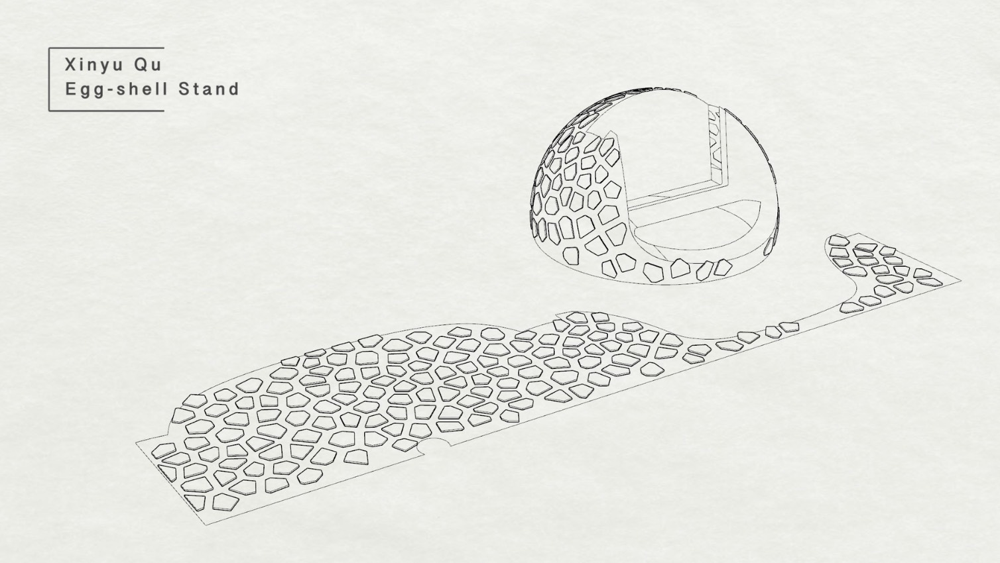

# Qu Xinyu Hiro's Document
## Week nine report

### Introduction
This weekly report summarizes my progress and activities during the past week as part of the "Mini Me" project, which focuses on designing an interaction interface using Large Language Models (LLMs) to simulate a personalized knowledge portfolio. In this report, I will provide an overview of the tasks I have completed and insights gained during the week.

### Project Overview
The "Mini Me" project aims to create an interactive portfolio that simulates a personalized interaction, exposing my knowledge as generated and captured throughout the DESINV 202 course. This project involves the design and management of knowledge sets, making informed decisions about what information to include and how to include it. The objective is to create a unique and personalized interface, distinct from a standard LLM interaction like ChatGPT4.

### Accomplishments
During this week, I achieved the following milestones:

### 1. ZeroWidth Account Setup
I successfully set up my ZeroWidth account, which will be a crucial component for creating the knowledge interface. ZeroWidth is a valuable platform for hosting static web pages and content. This step enables me to start building and testing the interactive portfolio.

### 2. Attended Design Lecture
I attended a design lecture that focused on using large language models for speech interaction design. The lecture provided valuable insights into the practical applications of LLMs, which will be useful in shaping the knowledge interface.

### 3. Initial Knowledge Context
I began organizing and structuring the knowledge context for my project. This involved selecting and curating relevant information from my course journal and other resources. I made decisions on what information to include and how to present it for a more personalized interaction.

## Next Steps
In the upcoming week, I plan to:

- Continue refining the knowledge context and making informed choices about what to include.
- Start building the interactive portfolio using the ZeroWidth platform.
- Experiment with LLM interaction to create a conversational and engaging user experience.
- Seek feedback from peers and mentors to ensure that the project aligns with its objectives.

## Conclusion
This week has been a productive start to the "Mini Me" project. I am excited to see the knowledge interface take shape and provide a unique and personalized experience for users. As I move forward, I will continue to learn and adapt to the challenges of designing with LLMs, striving for a seamless and meaningful interaction.

## Week Eight report

This week marks the conclusion of the second assignment. Here, I would like to briefly summarize our group project and my takeaways from this topic. The primary objective of this assignment was to acquire proficiency in using Photon and facilitating communication and interaction between multiple Photon boards. Additionally, it aimed to enhance our teamwork skills as we collaborated to create an engaging concept and prototype together.

### Project Background: 
We aim to create a virtual garden for each user by gathering data related to plants and their surroundings, including soil moisture and sunlight information. This data is collected and processed, and then a personalized virtual garden is constructed using Unity. This virtual garden serves as a platform for users to generate and record information about the plants they encounter.

### My work

In this week's work, my primary responsibilities included connecting and coding for the sensor-related Photon boards, as well as building the casing. Throughout this process, I found that it is quite similar to programming with the Arduino IDE for the most part. When connecting two different Photon boards, both boards need to be under the same account's permissions. The process of uploading code involves the first board uploading to the Photon cloud, and the second board reading from it. When considering how to establish communication between the two boards, I realized that since the first board has a soil moisture sensor and needs to be inserted into the soil for data collection, having it connected to a computer would be quite inconvenient. Therefore, the second board essentially serves as an information relay for future users to place in their homes, used for reading the collected data.

I also used a Falcon structure to create a wooden box because laser cutting is the quickest method for constructing a model. 

We then placed the circuit boards inside the box and proceeded to the next phase of testing. Meanwhile, my teammate focused on the Unity part. We integrated the data collected by the Photon into Unity and implemented the corresponding interactions.

In the course of this project, I gained valuable experience and insights. As part of my responsibilities, I worked on connecting and coding for the sensor-related Photon boards, as well as constructing an efficient wooden casing for the project. Here are some key takeaways and points to consider when working with Photon:

### Takeaways:
1. Similarity to Arduino: Working with Photon boards was akin to working with Arduino, which made the programming aspects familiar and manageable.
2. Account Permissions: When connecting two different Photon boards, it is essential that both boards have the necessary permissions within the same account for smooth code transfer.
3. Data Relay: One board, serving as an information relay (the second board in our case), can be a practical solution when a sensor-equipped board needs to be placed in a location that's inconvenient for direct connections (e.g., in the soil).
4. Efficiency with Laser Cutting: Utilizing laser cutting for constructing the wooden casing proved to be a rapid and efficient method for creating a suitable housing for the project.
5. Unity Integration: Team collaboration was vital as my teammate handled the Unity integration, which involved linking the data collected by the Photon boards to Unity and developing interactive features for the virtual garden.

In summary, this project provided a hands-on opportunity to work with Photon boards and develop a virtual garden that gathers plant-related data. The experience highlighted the importance of teamwork, familiarized me with Photon and Arduino-like programming, and emphasized efficiency in design and testing. To excel in projects like this, it's essential to prioritize user experience, data security, and scalability.

## Week Seven report

This week, my team and I had an in-depth discussion to further specify the types of information we need to collect. Our main focus includes soil moisture, sunlight intensity, temperature, and other related image data. This discussion helped us better plan and execute our project.

In this week's work, I took on the task of writing Photon code and was responsible for connecting the circuit board. This part of the work is crucial to ensure that we can successfully collect sensor data. We need to ensure that this data can be transmitted accurately and efficiently to our system.

Additionally, one of my team members proposed an interesting idea of outputting the collected information into Unity as images. This will add an exciting dimension to our project, allowing us to visualize and analyze the collected data more intuitively. This innovative approach will help us better understand and communicate our research findings.

Overall, this week we made significant progress in the discussion of information types and task assignments. I look forward to continuing our collaboration in future work to turn these ideas into reality and achieve our project goals.

## Week Six report
This week, we conducted a pitch for our group and sparked inspiration. I found my other three team members, and our main focus is on creating wearable technology for plant information collection. After several discussions, we finalized our design background, design objectives, and implementation methods.
## Week Five report
This week, we primarily familiarized ourselves with Photon's settings and brainstormed ideas for our upcoming second major project. I proposed an intriguing concept called "Apocalypse Design," which revolves around wearable technology, plant biology, bio-materials, and environmental data collection. 

This idea sparked the interest of our entire team, and we are eager to delve deeper into it and turn it into a reality. This project promises to be an exciting adventure, and we look forward to the challenges and innovations it will bring. In future blog posts, we will share more details and updates about the project, so stay tuned!
## Week Four report
This weekend, I organized the relevant materials for my first project. Primarily, I wrote a reflective report to articulate my thoughts on the process and the insights gained from my first project. I also discussed the implications of parametric design and computer-aided design for designers, citizens, and the future. During this process, I reflected on my experience and takeaways from using Grasshopper as my first parametric design tool.

Subsequently, I received the topic for my next assignment. I found it quite similar to the open-source hardware projects I've worked on before. I was pleased to receive a kit, as I didn't bring my Arduino-related components with me to the United States. Following the instructions, I registered an account, connected to Wi-Fi, configured the kit, and prepared for Thursday's class.

## Week Three report
This week, I continued to deepen my Grasshopper model.

This is my mobile phone stand design. I have experience with Rhino but have hardly used Grasshopper. I'm pleased to have learned the basics of parametric design through small-scale modeling in my daily work.

First, based on the existing mobile phone stand, I studied my phone usage habits. In the office environment, I often place my phone vertically, and in this position, the charging cable is prone to bending and damage. So, in my design, I added a space underneath and a charging cable opening. The specific implementation involved creating a cylinder slightly larger than the charging cable, rotating it using a plane, and then boolean subtracting it from the base.

Additionally, I wanted my model to have an organic surface texture. I tried two types of textures: one with intersecting circular perforations and the other with an eggshell-like texture.

and ultimately chose the fractured eggshell-like texture. To achieve this, I first created a rectangular frame of the appropriate area and randomly placed points inside it. We can adjust randomness by changing the seed. 

Then, I used a powerful tool called "Voronoi," which divided the irregular polygons like cell walls. I scaled these polygons inward using the "scale" tool, ensuring even spacing between different polygons, and then extruded the polygons. This texture was thus created.

For the final touches on the model, I returned to Rhino for surface flow, even though I didn't directly use Grasshopper. During this process, I learned the importance of analyzing the UV surface. By checking the direction of the UV surface's axis, I could ensure a consistent orientation, avoiding random results in the surface flow every time.

In the end, this is my model. I faced a few failed 3D printing attempts, 

but eventually, I achieved this model.

## Week Two report
This week I will adjust more about this cell phone stand
first i will follow the youtube video to have more precise idea about grasshopper

### there are questions about particular battery
1. the negative battery： a negative height （"Negative" is typically used to represent negative values or to indicate numbers that are less than zero in mathematical calculations.）
2. domain button："Domain" container typically includes two values, indicating the lower and upper bounds of the range. This is useful for defining the valid range of values for parameters, ensuring that models or designs stay within reasonable bounds during variations.
3. void button：A "Void" is typically a user-defined function or component. It is often used to represent a virtual or a placeholder element that doesn't directly perform any specific actions.
4. gravity and logic（the most interesting part in the video）

This part primarily projects the center of the entire object onto the tabletop, then compares the center with the center of gravity, using logical judgment to provide a color indication. This makes it convenient for designers to adjust parameters while having an early understanding of the model's stability.
### About battery
I found a chinese booklet for the basic grasshopper booklet
[booklet_pdf](https://jinjieming.com/wp-content/uploads/2016/02/Grasshopper%E5%AE%8C%E5%85%A8%E5%AD%A6%E4%B9%A0%E6%89%8B%E5%86%8CV1.0.pdf)

### Revising process
After making adjustments to the phone's angle, wall thickness, and other aspects based on the video, I discovered that there could be a small storage space in the front of the phone stand for keeping keys, and the bottom could serve as storage while also allowing vertical charging for the phone.

adding a charging hole
1. first make a cylinder as the charger line
   
3. generate a surface
   
5. rotate the cylinder
6. 
7. adujust the cylinder
8. stiff
   
10. bake

Thank you for the simple version youtube video, it really helps!! 😊😊😊😊😊😊

## Week one report

### Breif：
This week, I have completed the adjustments, output, and laser cutting process for existing files in Rhino and Grasshopper.

I first measured: 1. The length and width of my phone. 2. The approximate angle and height when I'm maintaining a normal distance from the table.

I became familiar with the Grasshopper file and the corresponding adjustable sliders.

I exported a file in AI format. It's important to ensure that:
1. The AI file is in RGB mode.
2. The string in AI: 0.001 inch = 0.072 pt red: cutting, black: non-penetrating.   

I selected a piece of wood and measured its thickness. Then, I adjusted the material, parameters, and starting point on the red laser cutting machine. Afterward, I initiated the cutting process. The entire procedure went smoothly, and soon my piece of wood was cut precisely as needed.

Later, I assembled my phone stand and attempted to place my phone on it. I compared my standing position, opened the front-facing camera, and checked if the ergonomics were suitable for comfortable use.

I believe that by pre-measuring the individual dimensions and requirements of each person and using the same file to modify parameters for the battery assembly, it's possible to rapidly generate various files and engage in the intriguing process of fabrication. Throughout this process, I consider the utilization of computer-based measurements and AI assistance to be a trend that enables the mass production of customized products with greater efficiency and scalability.
